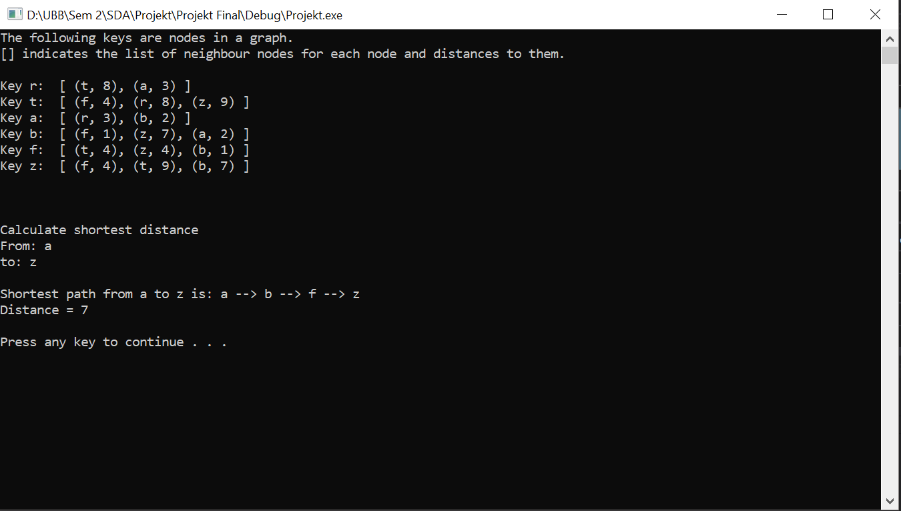

# MultiMap implementation

🗺️ C++ MultiMap implementation using a HashTable with collision resolution by chaining. 

(Data Structures Uni Assignment)

## Features
* Basic MultiMap operations
* An application using the implemented data structure to store nodes in a graph
* Calculate the shortest path between 2 given points

